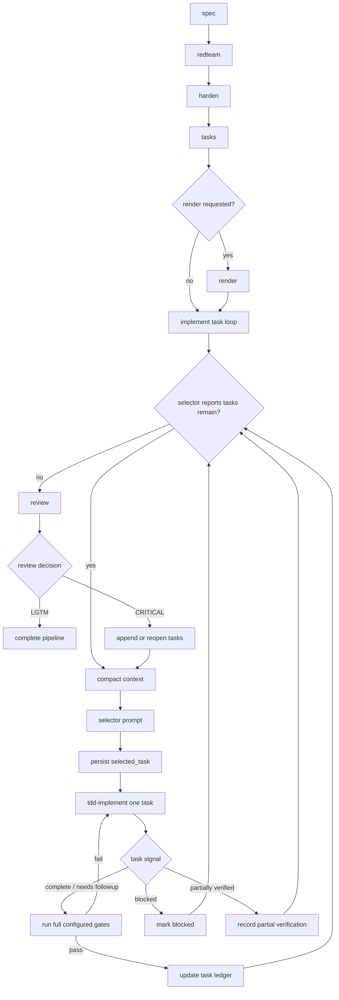
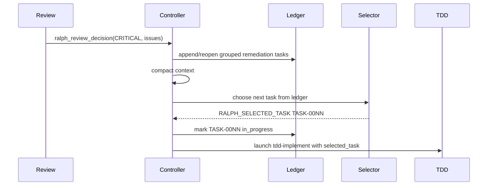

# Iterative Ralph Task Loop - Specification

> Status: DRAFT | Version: 1.0.0 | Author: Codex | Created: 2026-05-23

---

## Problem Statement

The current `implement` phase treats implementation as one broad Red-Green-Refactor pass. That does not match the updated `tdd-implement` skill, which now expects one persisted selected implementation task per invocation. The extension also does not yet create a controller-readable implementation task ledger, select the next task after compaction, persist selected task state, consume task-level completion signals, or convert CRITICAL review findings back into implementation tasks.

The desired redesign makes implementation an automatic task loop:

1. Hardened spec completes.
2. Ralph creates a comprehensive implementation task ledger.
3. Ralph compacts context.
4. Ralph launches a selector prompt that chooses one next implementation task from the Markdown ledger.
5. Ralph persists the selected task in state.
6. Ralph launches `tdd-implement` scoped only to that task.
7. The task must pass full configured gates before it is marked complete.
8. Ralph compacts and repeats until the selector reports no implementation tasks remain.
9. Ralph advances to review.
10. CRITICAL review findings create or reopen tasks in the original ledger and route back through the same loop.

### Current Evidence

| Area                  | Current Behavior                                                           | Gap                                                        |
| --------------------- | -------------------------------------------------------------------------- | ---------------------------------------------------------- |
| `tdd-implement` skill | Creates/updates `docs/specs/todo_<feature>.md` after implementation starts | Todo creation is too late and not controller-owned         |
| Extension phases      | `spec`, `redteam`, `harden`, optional `render`, `implement`, `review`      | No `tasks` phase before implementation                     |
| Pipeline state        | Persists phase and prompt metadata                                         | No task ledger path, selected task, or task loop status    |
| Completion markers    | Supports `RALPH_PHASE_COMPLETE`                                            | No task-level completion markers                           |
| Review CRITICAL       | Backtracks to `implement` with issue text                                  | Does not persist CRITICAL findings as implementation tasks |

---

## Environment Constraints

### Filesystem

| Path                            | Constraint                                                  | Impact                                                                                                |
| ------------------------------- | ----------------------------------------------------------- | ----------------------------------------------------------------------------------------------------- |
| `/home/peyton/code/ralph-works` | Primary checkout is for coordination and review             | Implementation work must occur in a dedicated git worktree                                            |
| `/tmp/ralph-works-*`            | Writable worktree location                                  | Spec, code, and tests for this change should be edited here                                           |
| `/home/peyton/.pi/agent/skills` | Live Pi skills checkout with unrelated dirty files possible | Skill changes should be isolated in a skill repo worktree and copied to live skills only when desired |
| `docs/specs/todo_<feature>.md`  | Markdown source of truth for tasks                          | Controller must parse and update this file conservatively                                             |

### Runtime

| Resource            | Available                              | Notes                                                    |
| ------------------- | -------------------------------------- | -------------------------------------------------------- |
| Network             | Restricted by sandbox unless escalated | Do not require network for tests                         |
| TypeScript compiler | Available through repo scripts         | Run `npm run typecheck` or `npm run check` as configured |
| Pi runtime          | Not fully simulated by unit tests      | Use pure functions and hook tests for most coverage      |

### Gate Policy

| Gate Condition                                | Behavior                                                                                                                                                |
| --------------------------------------------- | ------------------------------------------------------------------------------------------------------------------------------------------------------- |
| `.ralph/gate-config.json` exists and is valid | Full configured gates must pass before marking a task complete                                                                                          |
| Gate config missing                           | Task cannot be marked complete by invented defaults; the task may only progress according to documented project commands and explicit controller policy |
| Gate config invalid                           | Task completion must fail validation and request remediation                                                                                            |

---

## User Stories

| #   | Story                                                                                                                                 | Priority | Acceptance Criteria                                                                                                                                    |
| --- | ------------------------------------------------------------------------------------------------------------------------------------- | -------- | ------------------------------------------------------------------------------------------------------------------------------------------------------ |
| 1   | As an operator, I want Ralph to create an implementation task ledger from the hardened spec, so implementation has a durable backlog. | High     | A `tasks` phase writes `docs/specs/todo_<feature>.md`; post-hook validates parseable pending tasks.                                                    |
| 2   | As an operator, I want Ralph to automatically select one task at a time, so the TDD skill stays scoped.                               | High     | After compaction, the selector prompt chooses one task, Ralph persists it in state, and launches `tdd-implement` with `selected_task` and `task_file`. |
| 3   | As an operator, I want completed tasks gated before being marked done, so review does not inherit broken intermediate states.         | High     | `RALPH_TASK_COMPLETE` does not update the ledger to complete until full configured gates pass.                                                         |
| 4   | As an operator, I want blocked tasks skipped automatically, so the loop keeps making progress.                                        | Medium   | `RALPH_TASK_BLOCKED` marks the current task blocked, compacts context, and relaunches the selector without user approval.                              |
| 5   | As an operator, I want CRITICAL review findings converted into tasks, so remediation uses the same loop.                              | High     | `ralph_review_decision(CRITICAL)` triggers automatic task import into the original todo file, grouping related findings by root cause where practical. |

---

## Proposed Solution

### Overview

Add a new `tasks` phase and replace broad implementation completion with an implementation task loop. The Markdown task ledger is the source of truth. `PipelineState` mirrors the active task and loop metadata so context compaction and reloads are deterministic, but the controller reconciles from the ledger when state and file disagree.

### Pipeline Flow



_Caption: The implement phase becomes a loop over persisted task ledger entries._

### Phase Order

| Phase       | Required              | Position                        | Notes                                             |
| ----------- | --------------------- | ------------------------------- | ------------------------------------------------- |
| `spec`      | Yes for full pipeline | 1                               | Existing behavior                                 |
| `redteam`   | Yes for full pipeline | 2                               | Existing behavior                                 |
| `harden`    | Yes for full pipeline | 3                               | Produces hardened spec and changelog              |
| `tasks`     | Yes before implement  | 4                               | New phase; creates Markdown implementation ledger |
| `render`    | Optional              | Between `tasks` and `implement` | Still opt-in                                      |
| `implement` | Yes before review     | After `tasks`/optional `render` | Runs task loop, not broad implementation          |
| `review`    | Optional but default  | Final                           | CRITICAL routes back to task loop                 |

`validatePhaseOrder` should reject `implement` without `tasks`. No broad legacy implementation fallback is required.

### Task Ledger as Source of Truth

The task ledger path is:

```text
docs/specs/todo_<feature>.md
```

Markdown is the source of truth. To make it parseable, each task must use a strict heading and metadata block.

```markdown
# Implementation Tasks - <feature>

Spec: docs/specs/<feature>.md
Status: active
Version: 1

## Tasks

### TASK-0001: Add selected task state to PipelineState

- Status: pending
- Priority: P0
- Source: hardened_spec
- Depends On: none
- Review Finding Ref: none
- Files Hint: src/domain.ts, src/stateStore.ts
- Created: 2026-05-23T00:00:00.000Z
- Updated: 2026-05-23T00:00:00.000Z
- Completed: none

#### Acceptance Criteria

- PipelineState persists taskFile and selectedTask.
- Compaction reload can recover the selected task from state and ledger.

#### Test Plan

- Add unit coverage for task state serialization.
- Add reload coverage for selected task recovery.

#### Notes

- Keep state updates copy-on-write.
```

### Task Status Vocabulary

| Status               | Meaning                                                      | Selector Guidance                           |
| -------------------- | ------------------------------------------------------------ | ------------------------------------------- |
| `pending`            | Ready for selector consideration                             | Usually selectable                          |
| `in_progress`        | Currently selected by Ralph                                  | Avoid unless recovering stale state         |
| `complete`           | Implemented and full gates passed                            | Avoid                                       |
| `blocked`            | Could not proceed due to missing info or prerequisite        | Avoid until reopened or no alternative work |
| `partially_verified` | Implemented but required external verification could not run | Avoid unless reopened                       |
| `needs_followup`     | Current task complete and follow-up tasks were recorded      | Avoid                                       |

### Task Schema

| Field                | Required | Source                                                           |
| -------------------- | -------- | ---------------------------------------------------------------- |
| `id`                 | Yes      | Stable `TASK-0001` style heading                                 |
| `title`              | Yes      | Heading text                                                     |
| `priority`           | Yes      | `P0`, `P1`, `P2`, or `P3`                                        |
| `status`             | Yes      | Metadata block                                                   |
| `source`             | Yes      | `hardened_spec`, `review_critical`, `reopened_task`, or `manual` |
| `acceptanceCriteria` | Yes      | `#### Acceptance Criteria` bullets                               |
| `testPlan`           | Yes      | `#### Test Plan` bullets                                         |
| `filesHint`          | Yes      | Metadata block, comma-separated                                  |
| `dependsOn`          | Yes      | Metadata block, comma-separated or `none`                        |
| `reviewFindingRef`   | No       | Metadata block                                                   |
| `createdAt`          | Yes      | Metadata block                                                   |
| `updatedAt`          | Yes      | Metadata block                                                   |
| `completedAt`        | No       | Metadata block                                                   |

---

## Controller Design

### Pipeline State Additions

```typescript
export type RalphTaskStatus =
  | "pending"
  | "in_progress"
  | "complete"
  | "blocked"
  | "partially_verified"
  | "needs_followup";

export type RalphTaskSource = "hardened_spec" | "review_critical" | "reopened_task" | "manual";

export interface RalphImplementationTask {
  id: string;
  title: string;
  priority: "P0" | "P1" | "P2" | "P3";
  status: RalphTaskStatus;
  source: RalphTaskSource;
  acceptanceCriteria: string[];
  testPlan: string[];
  filesHint: string[];
  dependsOn: string[];
  reviewFindingRef?: string;
  createdAt: string;
  updatedAt: string;
  completedAt?: string;
}
```

Extend `PipelineState`:

```typescript
taskFile?: string;
selectedTask?: RalphImplementationTask;
taskLoopIteration?: number;
taskSelectorAttempts?: number;
lastTaskSignal?: "complete" | "blocked" | "partially_verified" | "needs_followup";
lastTaskSignalAt?: number;
```

State is a mirror for compaction survivability. The Markdown ledger remains authoritative for task status.

### Implement Phase Substates

| `phaseStatus`     | Meaning                                                           |
| ----------------- | ----------------------------------------------------------------- |
| `pre_hook`        | Existing phase launch boundary                                    |
| `selecting_task`  | Selector prompt is active                                         |
| `task_selected`   | Selected task persisted, TDD launch pending                       |
| `executing`       | `tdd-implement` is working on one task                            |
| `validating_task` | Task signal received; gates are running                           |
| `post_hook`       | All implementation tasks are done and implement phase is complete |

### Selector Prompt

The selector is a small internal prompt launched by Ralph during `implement`, not a public phase. It reads the Markdown task ledger and chooses the next task by judgment, using status, priority, dependencies, notes, and ledger order as inputs. The controller does not deterministically sort, re-rank, or reject a selected task because a different task appears more eligible.

The selector must return a single parseable final line:

```text
RALPH_SELECTED_TASK TASK-0001
```

If the selector determines no implementation task remains:

```text
RALPH_NO_TASKS_REMAIN
```

Ralph parses this line, loads the full task details from the Markdown ledger, persists `selectedTask`, marks the task `in_progress`, compacts context, and launches `tdd-implement`.

### TDD Launch Context

The implement phase prompt must pass both `selected_task` and `task_file` into the skill context:

```markdown
## Selected Task

<selected_task>
id: TASK-0001
title: Add selected task state to PipelineState
priority: P0
source: hardened_spec
...
</selected_task>

Task ledger: docs/specs/todo\_<feature>.md
```

The prompt must say that the agent may not implement adjacent pending tasks.

### Task Completion Signals

The controller must parse these exact final non-empty lines from assistant output during `implement`:

| Marker                          | Controller Behavior                                                                         |
| ------------------------------- | ------------------------------------------------------------------------------------------- |
| `RALPH_TASK_COMPLETE`           | Run full configured gates, then mark selected task `complete` if gates pass                 |
| `RALPH_TASK_BLOCKED`            | Mark selected task `blocked`, clear selected task, compact, relaunch selector               |
| `RALPH_TASK_PARTIALLY_VERIFIED` | Run gates if code changed, mark `partially_verified`, relaunch selector                     |
| `RALPH_TASK_NEEDS_FOLLOWUP`     | Run full configured gates, mark current task `needs_followup`, keep any new tasks in ledger |

`RALPH_PHASE_COMPLETE` should not complete the implement phase while the task loop is active. In the new model, the implement phase completes when the selector returns `RALPH_NO_TASKS_REMAIN`.

### Gate Requirement

Before marking a task `complete` or `needs_followup`, Ralph must run full configured gates from `.ralph/gate-config.json`.

| Gate Result               | Outcome                                                                                                                                          |
| ------------------------- | ------------------------------------------------------------------------------------------------------------------------------------------------ |
| All configured gates pass | Update ledger and continue task loop                                                                                                             |
| Any configured gate fails | Keep task `in_progress`, send failure details back to TDD                                                                                        |
| Gate config invalid       | Keep task `in_progress`, enter validation failure                                                                                                |
| No configured gates       | Do not invent defaults; rely on documented project commands captured by task summary and make the controller behavior explicit in implementation |

### Review CRITICAL Backtracking

When `ralph_review_decision` receives `CRITICAL`:

1. Increment review iteration as today.
2. Read the original task ledger.
3. Read the latest review report when available.
4. Convert CRITICAL findings into new or reopened tasks.
5. Group related findings into one task when they share a root cause.
6. Append tasks to the same `docs/specs/todo_<feature>.md` file.
7. Set phase back to `implement`.
8. Compact context.
9. Relaunch the selector.

Review remediation task source should be `review_critical`. `reviewFindingRef` should include the review iteration and finding title or index.



_Caption: Review findings reenter the same task loop instead of launching a separate remediation path._

---

## Skill Changes

### New `tasks` Skill

Add `tasks/SKILL.md` to `ralph-works-skills`.

Responsibilities:

| Responsibility              | Detail                                                               |
| --------------------------- | -------------------------------------------------------------------- |
| Read hardened spec          | Use `docs/specs/<feature>.md` after `status: hardened` validation    |
| Read harden changelog       | Include mitigations and deferred risks in task planning              |
| Create comprehensive ledger | Write `docs/specs/todo_<feature>.md` in strict Markdown format       |
| Produce task IDs            | Use stable sequential IDs starting at `TASK-0001`                    |
| Prioritize                  | Use `P0` for blockers/security/core contracts, then `P1`, `P2`, `P3` |
| Include tests               | Every task must have task-level acceptance criteria and test plan    |
| Avoid implementation        | The skill creates tasks only                                         |

Completion marker:

```text
RALPH_PHASE_COMPLETE
```

### Update `tdd-implement`

The skill was already updated to operate on one `selected_task`. Additional alignment may be needed after controller implementation:

| Area                             | Required Wording                                                                                        |
| -------------------------------- | ------------------------------------------------------------------------------------------------------- |
| No fallback broad implementation | If no `selected_task` or `task_file` is provided, block rather than deriving a full implementation plan |
| Markdown source of truth         | Update the selected task section in `docs/specs/todo_<feature>.md`                                      |
| Task signal                      | End with one `RALPH_TASK_*` marker in task-loop mode                                                    |

### Update `pr-reviewer`

Review output should make task conversion reliable:

| Area              | Required Wording                                                   |
| ----------------- | ------------------------------------------------------------------ |
| CRITICAL findings | Include stable finding numbers or titles                           |
| Root cause hints  | Group findings by root cause when obvious                          |
| Test gaps         | Mark missing regression tests as CRITICAL or WARNING based on risk |
| Persisted report  | Continue writing `.ralph/review-iteration-<N>.md`                  |

---

## Implementation Plan

| Step | Area                | Work                                                                                        | Tests                                                         |
| ---- | ------------------- | ------------------------------------------------------------------------------------------- | ------------------------------------------------------------- |
| 1    | Skills              | Add `tasks/SKILL.md`; update `tdd-implement` and `pr-reviewer` wording if needed            | Skill file prerequisite tests                                 |
| 2    | Phase config        | Add `tasks` to phase order, defaults, metadata, skill validation, and artifact expectations | `validatePhaseOrder`, missing skill prerequisite tests        |
| 3    | Ledger parser       | Add strict Markdown parser/updater for task entries                                         | Unit tests for parse, update, append, reopen, malformed files |
| 4    | State model         | Add task fields to `PipelineState` and copy-on-write helpers                                | Serialization/reload tests                                    |
| 5    | Task selector       | Add selector prompt handling and `RALPH_SELECTED_TASK` parser                               | Agent-end parser tests                                        |
| 6    | Implement loop      | Replace broad implement completion with task loop                                           | Phase-launch and task-marker tests                            |
| 7    | Gates               | Require full configured gates before completing tasks                                       | Gate pass/fail task completion tests                          |
| 8    | Review backtracking | Convert/group CRITICAL findings into ledger tasks                                           | `ralph_review_decision` tests                                 |
| 9    | Compaction          | Compact between task completions and before selection                                       | Session-start/reorientation tests                             |
| 10   | Docs                | Update README and phase descriptions                                                        | Documentation review                                          |

---

## Testing Strategy

### Unit Tests

| Module                 | Coverage                                                                         |
| ---------------------- | -------------------------------------------------------------------------------- |
| `stateMachine.ts`      | Phase order with `tasks`, task marker parsing, selector marker parsing           |
| New task ledger module | Parse strict Markdown, update status, append review tasks, reopen completed task |
| `stateController.ts`   | Enter selecting, task selected, task validating, blocked skip                    |
| `prompts.ts`           | Build tasks phase prompt, selector prompt, selected task TDD prompt              |

### Integration Tests

| Scenario                         | Expected Result                                                        |
| -------------------------------- | ---------------------------------------------------------------------- |
| Full default phase list          | Includes `tasks`, excludes `render` unless requested                   |
| Harden completes                 | `tasks` phase launches before `implement`                              |
| Tasks phase completes            | Todo file exists and contains parseable pending tasks                  |
| Selector picks task              | State stores selected task and ledger marks it `in_progress`           |
| Task complete with gates passing | Ledger marks task `complete`, selected task clears, next task selected |
| Task complete with gates failing | Ledger stays `in_progress`, failure steer sent                         |
| Task blocked                     | Ledger marks `blocked`, next unblocked task selected                   |
| No pending tasks                 | Implement phase completes and review launches                          |
| Review CRITICAL                  | New/reopened tasks added to original ledger, implement loop resumes    |

### Manual Smoke Test

Run a small pipeline with a hardened spec that yields two tasks:

1. Confirm `tasks` creates `docs/specs/todo_<feature>.md`.
2. Confirm the first task selection is persisted in `/ralph-works status`.
3. Complete the first task and verify gates run.
4. Confirm Ralph compacts and selects the second task automatically.
5. Submit a CRITICAL review decision and confirm a remediation task appears in the same todo file.

---

## Risks and Mitigations

| Risk                                 | Likelihood | Impact | Mitigation                                                                                      |
| ------------------------------------ | ---------- | ------ | ----------------------------------------------------------------------------------------------- |
| Markdown parsing is brittle          | Medium     | High   | Use strict heading and metadata grammar with unit tests and clear validation errors             |
| Selector picks an impossible task    | Medium     | Medium | Check dependencies and blocked status deterministically before accepting selector output        |
| Gate failures cause loop churn       | Medium     | Medium | Keep task `in_progress` and send a targeted failure steer with gate output                      |
| CRITICAL findings are too vague      | Medium     | Medium | Fall back to one task per finding when grouping confidence is low                               |
| Context compaction loses task detail | Low        | High   | Persist `selectedTask` in state and task ledger path in state; rehydrate from ledger on reload  |
| No gate config exists                | Medium     | High   | Spec implementation must decide explicit no-gate behavior before coding; do not invent defaults |

---

## Open Questions

| Question                                                                     | Default Assumption                                                                |
| ---------------------------------------------------------------------------- | --------------------------------------------------------------------------------- |
| Should no configured gates block task completion entirely?                   | No, but the implementation must document and test the exact fallback behavior.    |
| Should blocked tasks ever be reopened automatically?                         | Only review CRITICAL or a new task-generation pass can reopen them.               |
| Should selector output be produced by a registered tool instead of a marker? | Marker is the initial design; a tool can be considered if parsing proves fragile. |

---

## Acceptance Criteria

- Default phase order includes `tasks` between `harden` and `implement`.
- `implement` without `tasks` is invalid.
- `tasks` phase writes a strict Markdown ledger at `docs/specs/todo_<feature>.md`.
- Controller persists `taskFile` plus the selected task; task ordering decisions belong to the selector prompt, not deterministic controller parsing.
- Ralph automatically compacts, selects, persists, and launches one task at a time.
- `tdd-implement` receives `selected_task` and `task_file` in its phase prompt.
- `RALPH_TASK_COMPLETE` requires full configured gates before ledger completion.
- `RALPH_TASK_BLOCKED` marks the task blocked and relaunches the selector.
- Review CRITICAL findings append or reopen grouped remediation tasks in the original ledger.
- When the selector returns `RALPH_NO_TASKS_REMAIN`, the implement phase completes and review starts.
